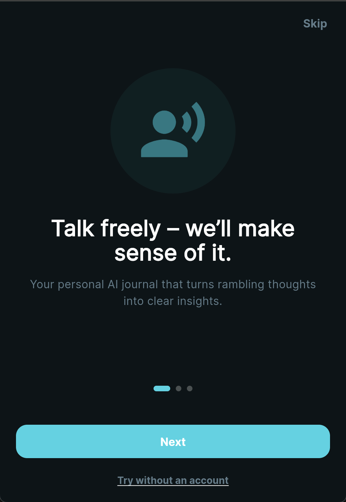

# Calm Clarity: Personal AI Coach & Journaling 🚀

Calm Clarity is a state-of-the-art, integrated personal AI coaching and voice journaling platform. Built with a high-performance FastAPI backend and a premium Flutter frontend, Calm Clarity combines voice journaling, mood tracking, AI coaching, notifications, and observability into a single, seamless experience.



[](https://seelneas.github.io/calm-clarity/)

## ✨ Core Features

### 🤖 Advanced AI Coaching
- **AI Coach Persona**: Sophisticated, proactive, and personalized intelligence partner.
- **Multimodal Providers**: Integrated with Groq, Google Gemini, and OpenAI for high-speed, intelligent responses. Fallbacks to rule-based responses if no AI key is provided.
- **Asynchronous AI Jobs**: Dedicated queue workers handle complex background AI tasks without blocking the user interface.

### 📅 Unified Wellness Suite
- **Voice Journaling**: Record your thoughts effortlessly.
- **Mood Tracking**: Log and track your emotional state over time.
- **Notifications**: Proactive nudges and reminders for your mental wellness journey.

### 🔐 Secure Authentication & Utility
- **Robust Auth**: Secured Google OAuth Web Client integration.
- **Centralized Secret Management**: Runtime secret loading via `backend/secret_manager.py`, supporting AWS Secrets Manager, GCP Secret Manager, Azure Key Vault, and Vault.
- **Health Diagnostics**: Real-time observability and logging built-in.

## 🛠️ Tech Stack

### Backend
- **Core Framework**: Python 3.10+ with FastAPI
- **Messaging/Queue**: Redis (for background task processing via `worker_supervisor.py`)
- **AI Models**: Groq, Google Gemini, and OpenAI

### Frontend
- **Framework**: Flutter (Dart)
- **Platform Support**: Android, iOS, Web (Chrome)
- **Communication**: REST APIs with dependency injection (`API_BASE_URL`)

## 🏁 Getting Started

### 1. Prerequisites
- Flutter SDK
- Python 3.10+
- `pip`
- (Optional, recommended) Redis for queue workers

### 2. Backend Installation
```bash
cd backend
python -m venv .venv
source .venv/bin/activate
pip install -r requirements.txt
# Configure your API Keys and Google Client ID
export GOOGLE_CLIENT_ID=<your-google-oauth-web-client-id>
uvicorn main:app --reload
```
Backend docs will be available at: `http://127.0.0.1:8000/docs`

### 3. Frontend Installation
```bash
# Return to the repo root
flutter pub get
```

**Run on Android emulator:**
```bash
flutter run \
	--dart-define=API_BASE_URL=http://10.0.2.2:8000 \
	--dart-define=GOOGLE_WEB_CLIENT_ID=<your-google-oauth-web-client-id>
```

**Run on Web (Chrome):**
```bash
flutter run -d chrome \
	--dart-define=API_BASE_URL=http://127.0.0.1:8000 \
	--dart-define=GOOGLE_WEB_CLIENT_ID=<your-google-oauth-web-client-id>
```

*(Note: If you change any `--dart-define`, do a full restart, not only a hot reload.)*

### 4. Build Android APK
To generate a release APK that you can install on an Android device, run:
```bash
flutter build apk --release
```
Once the build completes, your `.apk` file will be located at:
`build/app/outputs/flutter-apk/app-release.apk`

**(Optional) Testing**
From repo root, run Flutter unit and widget tests:
```bash
flutter test
```

## 🧠 Technical Challenges & Decisions
- **AI Provider Orchestration**: Managing multiple LLM providers (Groq, Gemini, OpenAI) required a unified interface to decouple core logic from specific APIs, ensuring seamless provider switching and robust fallback mechanisms.
- **Background Processing**: To ensure a responsive UX during AI responses, async operations and complex AI tool execution are handed off to background queue workers (`worker_supervisor.py`).

## 🛡️ Security Audit & Best Practices
- **Zero Hardcoded Secrets**: A comprehensive audit ensures all sensitive keys (API, Database) are managed exclusively through environment variables.
- **Managed Secrets in Production**: Production environments strictly require managed-secret references (`aws-sm://`, `gcp-sm://`, `azure-kv://`) and enforce `MANAGED_SECRETS_REQUIRED_IN_PRODUCTION=true`.
- **OAuth Validation**: Strict validation ensures Google popup contexts match the exact deployed frontend origins and web client IDs.

## 🏗️ Architecture

Loading...

## 📜 License
This project is licensed under the MIT License - see the [LICENSE](LICENSE) file for details.

Managed by seelneas.
